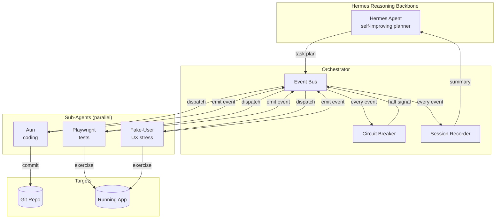
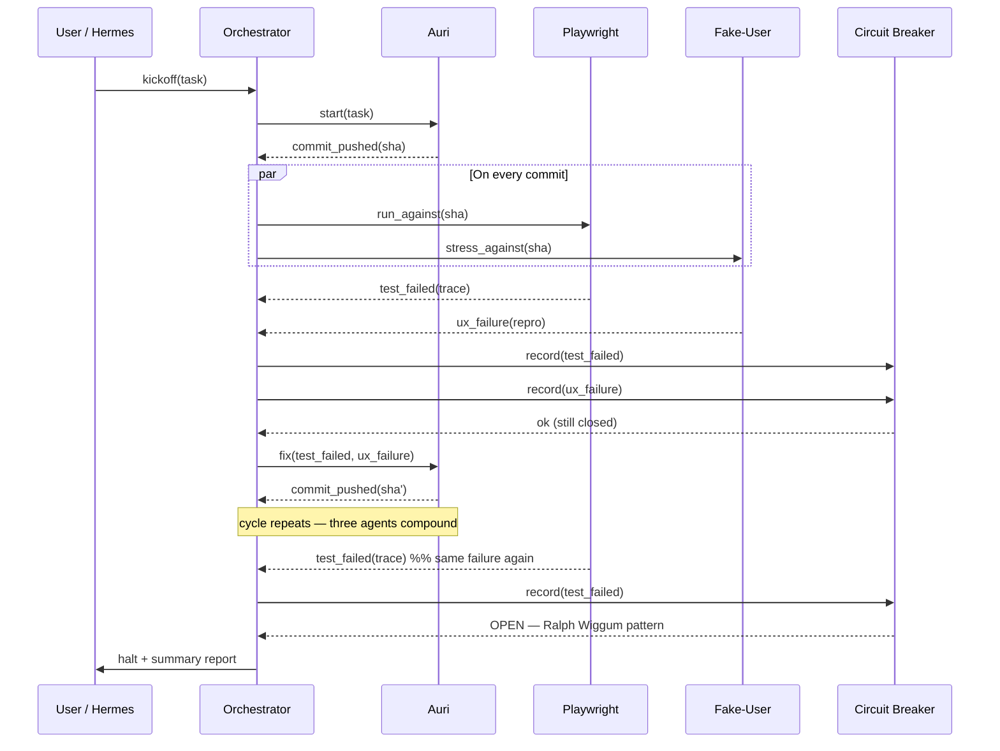
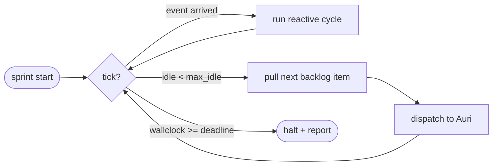
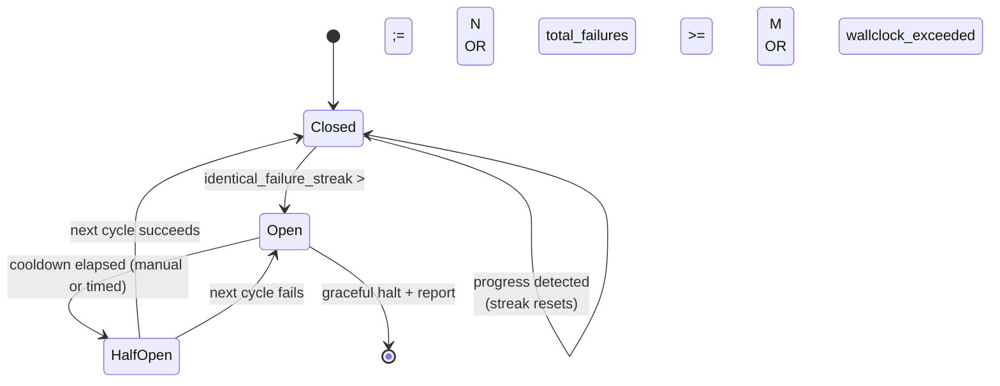

# Autonomous Dev Loop Engine — Architecture

**Codename:** Hermes × Auri × Playwright × Fake-User
**Owner:** Auri (in collaboration with Bodhi and Madhav)
**Status:** Spec v1 — prototype harness lives in `./src`

---

## 1. Goal

Run a fleet of cooperating agents that can develop, test, and stress-test the
Powerclub Global web app without a human in the inner loop, while remaining
safe enough to leave running for an overnight sprint.

Two operating modes are required:

1. **Reactive mode (Madhav's refinement)** — the default. The orchestrator
   listens for events (`commit_pushed`, `agent_blocked`, `test_failed`,
   `ux_failure`). Whenever one fires, the three sub-agents (Auri, Playwright,
   Fake-User) spin up in parallel and compound on each other's output.
2. **Sustained loop mode (Bodhi's original vision)** — a time-boxed wall-clock
   run (default 6–8 hours) that keeps the reactive cycle ticking even when no
   external event arrives, so the engine can grind on a backlog overnight.

Both modes share the same execution graph; only the trigger source differs.

## 2. Agent Stack

| Agent           | Role                                                  | Outputs                          |
| --------------- | ----------------------------------------------------- | -------------------------------- |
| **Auri**        | Coding agent. Writes, edits, and commits code.        | git commits, patch summaries     |
| **Playwright**  | Automated test agent. Runs e2e / regression suites.   | test reports, failure traces     |
| **Fake-User**   | UX stress tester. Drives realistic UI flows, looking  | UX defect tickets, repro recipes |
|                 | for breakage humans would notice.                     |                                  |

The reasoning backbone is **Hermes Agent** ([Nous Research](https://github.com/nousresearch/hermes-agent))
— it owns the strategic loop (what to work on next, when to halt, when to
escalate to a human).

## 3. High-Level Architecture

## 4. Reactive Mode — Event Flow

## 5. Sustained Loop Mode

Sustained mode is just reactive mode with two extra wrappers:

1. **Wall-clock deadline** (`--duration 8h`) — emits a synthetic `halt` event.
2. **Idle pump** — if no event arrives within `max_idle_seconds`, the
   orchestrator pulls the next backlog item from Hermes and dispatches it to
   Auri. Prevents the loop from stalling silently.

## 6. Circuit Breaker — Ralph Wiggum Defense

Reference incident: [r/ClaudeCode — credit burn on repeated broken logic](https://www.reddit.com/r/ClaudeCode/comments/1q2qvta/).
An agent loops on the same broken fix, burning credits without progress.

The breaker is a small state machine sitting between the event bus and the
agents:

**Detection signals tracked per failure:**

- `signature` — hash of (failure_kind, top-of-stack frame, test name).
  Two failures with the same signature in a row = Ralph Wiggum candidate.
- `identical_failure_streak` — count of back-to-back identical signatures.
  Threshold defaults to `3`.
- `total_failures` — absolute count across the run.
  Default cap `25`.
- `progress_window` — number of cycles since the last *new* commit landed
  without rolling back. If `progress_window >= 5`, breaker opens regardless of
  signatures (covers the case where Auri keeps committing but nothing
  meaningful is moving).

**Graceful halt** writes a markdown report (`./reports/run-<ts>.md`)
containing: triggering signature, last N events, last good commit SHA,
recommended next human action.

## 7. Orchestration Harness

The prototype lives in [`./src`](./src):

| File                        | Purpose                                                            |
| --------------------------- | ------------------------------------------------------------------ |
| `types.ts`                  | Shared event / agent types.                                        |
| `event-bus.ts`              | Tiny in-memory pub/sub. One subscriber per agent.                  |
| `circuit-breaker.ts`        | State machine described in §6. Pure, unit-testable.                |
| `agents.ts`                 | `AuriAgent`, `PlaywrightAgent`, `FakeUserAgent` — adapters.        |
| `orchestrator.ts`           | Wires bus + breaker + agents. Supports both modes.                 |
| `demo.ts`                   | Scripted run with simulated agents — used as the working test run. |

The agent adapters are deliberately thin — they take a transport (e.g. a CLI
subprocess for the real Auri, a `playwright test` runner, an LLM-driven UI
script for Fake-User) and translate to/from the orchestrator's event vocab.
For the prototype the transport is a stub so we can validate the orchestration
graph without standing up the full stack.

## 8. Working Test Run

`npm run demo` (inside `loop-engine/`) executes a scripted run against a
simulated Powerclub web target. The scenario:

1. Auri commits a change to `/orcha/page.tsx`.
2. Playwright finds a broken e2e — Auri attempts a fix.
3. Fake-User finds the same UX bug 3x in a row.
4. Circuit breaker opens on the Ralph Wiggum streak and writes a report.

This exercises every state transition in §6 and produces a sample
`reports/run-<ts>.md` that becomes the deliverable PR's body.

## 9. Milestones & Check-ins with Nora

| Milestone                            | Check-in trigger                              |
| ------------------------------------ | --------------------------------------------- |
| M1 — Spec + harness compiles          | This PR (you are here).                       |
| M2 — Demo run produces report         | First green `npm run demo`.                   |
| M3 — Real Playwright wired           | First real e2e failure caught by the breaker. |
| M4 — Real Auri wired                 | First autonomous commit landed via the loop.  |
| M5 — First overnight sustained run   | 8h run finishes without runaway credit burn.  |

## 10. Open Questions

- **Hermes integration**: do we run Hermes in-process or as a sibling service?
  Leaning sibling — keeps the planner restartable independently of the loop.
- **Concurrency budget**: how many parallel commits can Playwright realistically
  test before the dev server thrashes? Needs measurement on the real repo.
- **Credit budget**: should the breaker also open on a $-spent threshold, not
  just failure signatures? Probably yes once we have the cost-accounting hook.
